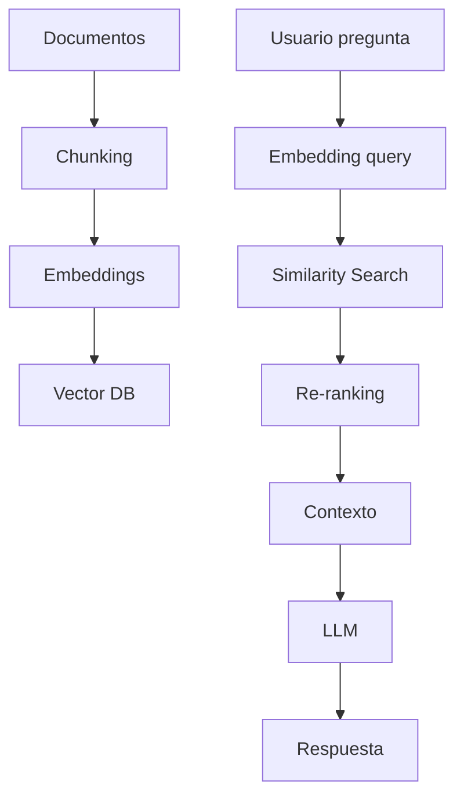
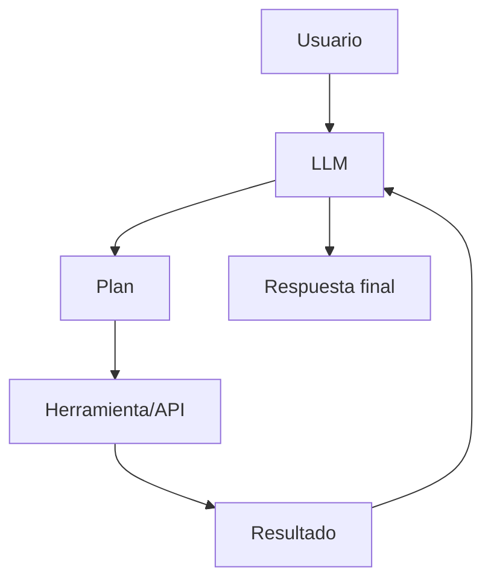
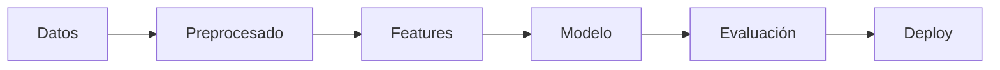

# 🤖 AI Development Concepts & Pipelines (Practical README)

Guía práctica con conceptos clave (definiciones + código) y pipelines usados en aplicaciones reales de IA.

---

# 🧠 1. Fundamentos de IA

* **IA:** Sistemas que imitan capacidades humanas como razonar o decidir.
* **ML:** Modelos que aprenden patrones a partir de datos.
* **DL:** Subcampo del ML basado en redes neuronales profundas.

```python
# Ejemplo simple: modelo de clasificación
from sklearn.linear_model import LogisticRegression

model = LogisticRegression()
model.fit(X_train, y_train)
pred = model.predict(X_test)
```

---

# 📊 2. Datos y entrenamiento

* **Dataset:** Conjunto de datos para entrenar o evaluar.
* **Features:** Variables de entrada del modelo.
* **Labels:** Respuestas correctas.
* **Entrenamiento:** Ajuste del modelo con datos.

```python
import pandas as pd

data = pd.read_csv("data.csv")
X = data[["edad", "ingresos"]]
y = data["compra"]
```

---

# 🧩 3. Chunking

* **Chunking:** Técnica de dividir texto en fragmentos pequeños para facilitar procesamiento y búsqueda.

```python
def chunk_text(text, size=200, overlap=50):
    chunks = []
    for i in range(0, len(text), size - overlap):
        chunks.append(text[i:i+size])
    return chunks
```

---

# 🔢 4. Embeddings

* **Embedding:** Representación numérica (vector) del significado de un texto.
* **Cosine similarity:** Métrica para medir similitud entre embeddings.

```python
from openai import OpenAI
client = OpenAI()

emb = client.embeddings.create(
    model="text-embedding-3-small",
    input="La IA es poderosa"
)
```

---

# 🔍 5. RAG (Retrieval-Augmented Generation)

* **RAG:** Técnica que combina recuperación de información con generación de texto.
* **Vector DB:** Base de datos de embeddings.
* **Top-K:** Selección de los resultados más relevantes.

```python
query_emb = client.embeddings.create(
    model="text-embedding-3-small",
    input="¿Qué es IA?"
)

results = vector_db.search(query_emb, top_k=5)
```

---

# 🔁 6. Re-ranking

* **Re-ranking:** Reordenar resultados de búsqueda usando un modelo más preciso.

```python
reranked = sorted(results, key=lambda x: x.score, reverse=True)
final = reranked[:3]
```

---

# 🧠 7. Generación con LLM

* **LLM:** Modelo de lenguaje capaz de generar texto.
* **Temperature:** Controla creatividad.

```python
response = client.chat.completions.create(
    model="gpt-4o-mini",
    messages=[
        {"role": "system", "content": "Responde con contexto"},
        {"role": "user", "content": "Explica IA"}
    ]
)
```

---

# 🧪 8. Prompt Engineering

* **Prompt:** Instrucción que guía al modelo.
* **Few-shot:** Uso de ejemplos.

```python
prompt = f"""
Usa este contexto:
{context}

Pregunta: {question}
"""
```

---

# ⚙️ 9. Agentes

* **Agente:** Sistema que decide acciones y usa herramientas.

```python
# pseudo-agente
while True:
    plan = llm("¿qué hacer?")
    result = tool(plan)
```

---

# 📈 10. Evaluación

* **Accuracy:** Proporción de aciertos del modelo.

```python
from sklearn.metrics import accuracy_score
accuracy_score(y_true, y_pred)
```

---

# ⚡ 11. Producción

* **Latency:** Tiempo de respuesta.
* **Caching:** Guardar resultados para eficiencia.

```python
cache = {}
if query in cache:
    return cache[query]
```

---

# 🔐 12. Seguridad

* **Bias:** Sesgos en el modelo.
* **Prompt injection:** Ataques mediante inputs maliciosos.

---

# 🖼️ Diagramas

## 🔍 Arquitectura RAG



## 🤖 Arquitectura de Agente



## 📊 Pipeline ML clásico



---

# 🚀 Pipelines

## ML clásico

```
Datos → Features → Modelo → Evaluación → Deploy
```

## RAG moderno

```
Docs → Chunking → Embeddings → DB
Query → Retrieval → Re-ranking → LLM
```

## Agentes

```
User → LLM → Plan → Tools → Output
```

---

# 🧠 Resumen

* ML predice
* RAG conecta conocimiento
* LLM genera
* Agentes actúan

---

# 📚 Recursos

* [https://huggingface.co/learn](https://huggingface.co/learn)
* [https://fullstackdeeplearning.com/](https://fullstackdeeplearning.com/)
* [https://www.deeplearning.ai/](https://www.deeplearning.ai/)

---

# ⭐ Uso recomendado

Este README sirve como:

* Base para proyectos RAG
* Guía rápida de conceptos
* Plantilla para repositorios de IA
